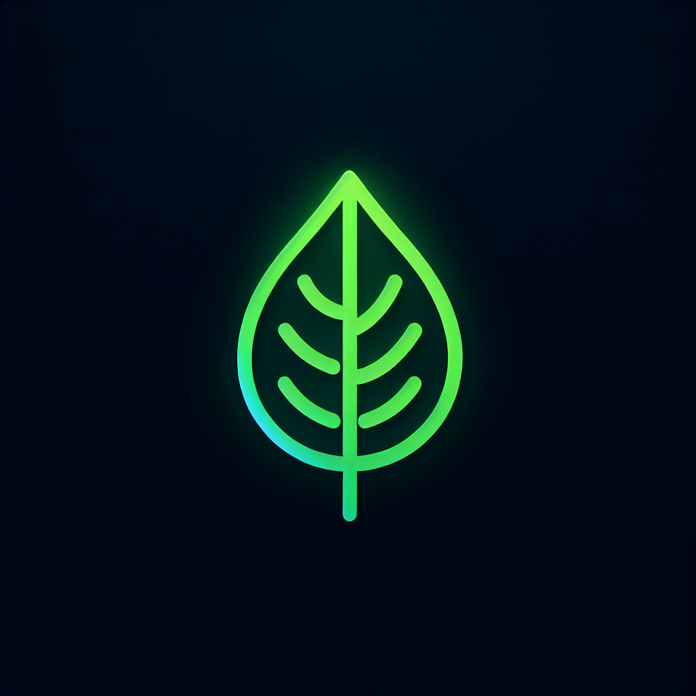

# Eco Fashion E-Commerce Platform

Sustainable fashion e-commerce platform. Built by Jerome Bushie Larbelee.

 <!-- Replace with your logo -->

## Overview

Eco Fashion showcases and sells eco-friendly fashion. It features a React frontend and a Django (Python) backend (`Ecothread` project, `ecommerce` app) serving a RESTful API. The database is PostgreSQL.

## Core Features

- Product browsing, filtering, and search
- Detailed product pages with sustainability ratings
- Shopping cart & user accounts (Django auth)
- Secure checkout and order history
- Responsive design for desktop/tablet

## Technology Stack

- **Frontend**: React, Vite, Tailwind CSS, Shadcn UI, React Router, Axios
- **Backend**: Django, Django REST Framework (DRF), PostgreSQL
- **Django Project**: `Ecothread`
- **Main Django App**: `ecommerce`

## Getting Started

### Prerequisites

- Python 3.8+, Pip, Virtualenv/venv
- PostgreSQL (running)
- Node.js 14+, npm/yarn

### Quick Setup & Run

1.  **Clone:**
    ```bash
    git clone https://github.com/yourusername/eco-fashion.git
    cd eco-fashion
    ```

2.  **Backend (Django - `Ecothread` project, `ecommerce` app):**
    ```bash
    cd backend-django # Dir with manage.py & Ecothread project
    python -m venv venv && source venv/bin/activate # Or venv\Scripts\activate
    pip install -r requirements.txt
    # Configure .env for PostgreSQL (see Ecothread/settings.py)
    python manage.py migrate
    # python manage.py createsuperuser (optional)
    python manage.py runserver
    ```
    (Backend typically on `http://localhost:8000`)

3.  **Frontend (React):**
    (Open a new terminal)
    ```bash
    cd frontend
    npm install
    npm run dev
    ```
    (Frontend typically on `http://localhost:5000`, proxies to backend)

Access the web app via the frontend URL.

## Project Structure Highlights
eco-fashion/
├── backend-django/ # Django root
│ ├── Ecothread/ # Django project (settings, urls)
│ ├── ecommerce/ # Main Django app (models, views)
│ └── manage.py
├── frontend/ # React app root
│ └── src/
└── README.md


## API & Data (Conceptual)

- **API**: Django/DRF provides REST endpoints for Auth, Products, Categories, Cart, Orders.
- **Data Models**: Django ORM models (in `ecommerce` app) define Products, Categories, Users (Django Auth), Orders for PostgreSQL.
    - **Product Example**: `id, title, slug, category_id, description, price, image_url, sustainability_rating, variants (related model)`

## Authentication

Token-based authentication via Django backend (DRF Token/JWT). Frontend stores token and sends in `Authorization` header.

## Deployment

- **Backend (Django - `Ecothread`)**: PaaS (Heroku), Gunicorn/Nginx on VPS, Docker. Configure `SECRET_KEY`, `DEBUG=False`, DB URL, `collectstatic`.
- **Frontend (React)**: Static build (`npm run build`) to Vercel, Netlify, S3+CloudFront.

## Contributing

1.  Fork & create a feature branch.
2.  Commit changes.
3.  Push & open a Pull Request.

---
Developed by Jerome Bushie Larbelee.
